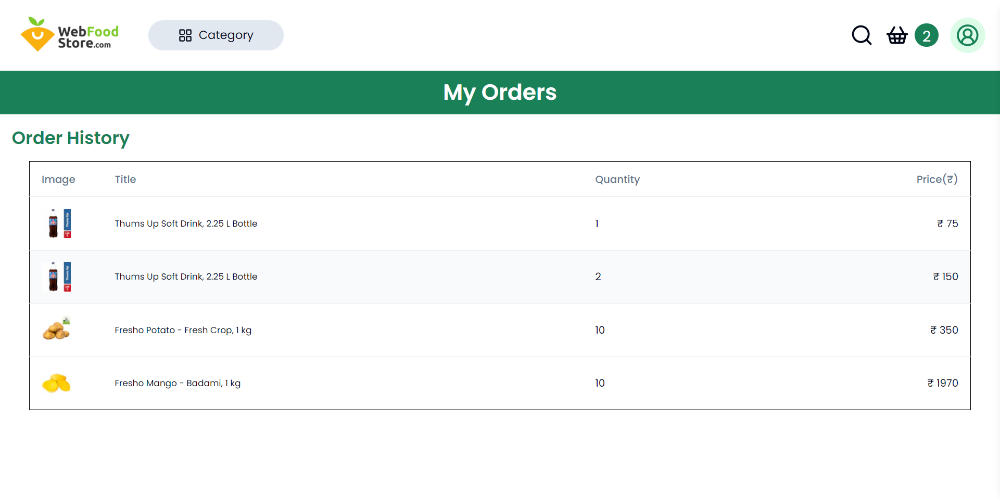
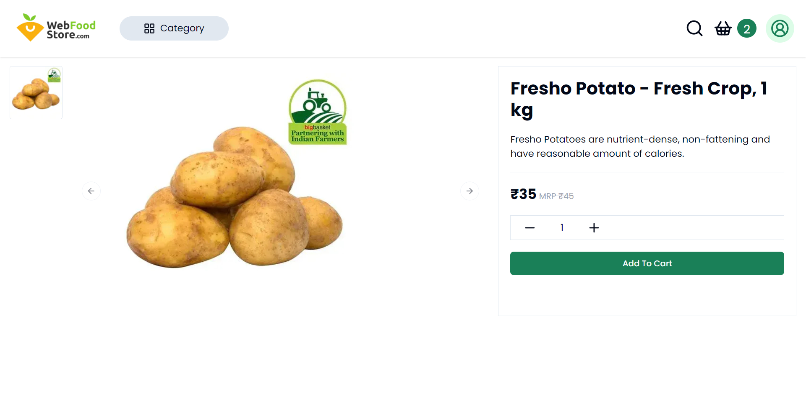
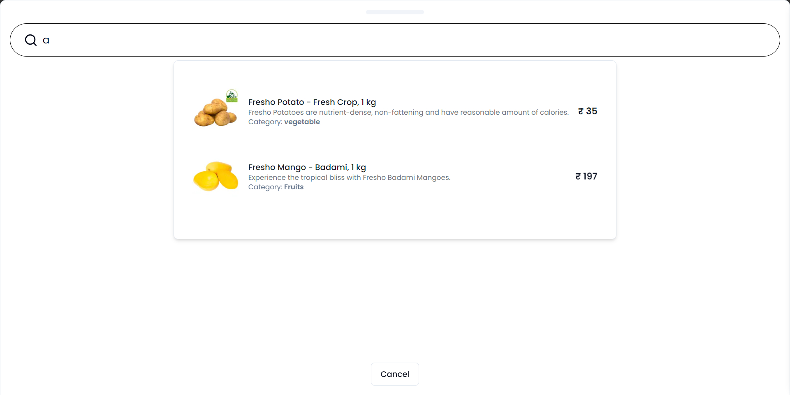
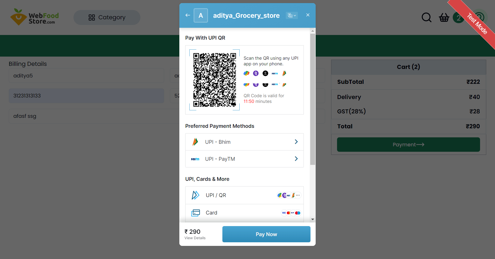
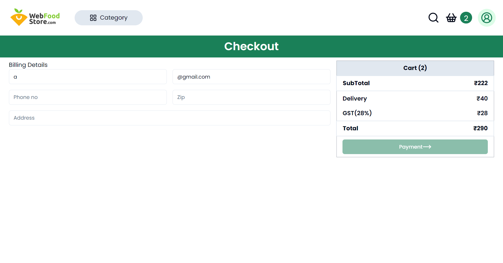

#  Grocery Store

## Description

This project is an online grocery store application built with Next.js, Tailwind CSS, and Shader UI. It utilizes Razorpay Payment Gateway for processing online payments and Axios for making HTTP requests.

## Technologies Used

- [Next.js](https://nextjs.org/): ⚛️ A React framework for building server-rendered applications.
- [Tailwind CSS](https://tailwindcss.com/): 🎨 A utility-first CSS framework for building custom designs quickly.
- [Shader UI](https://shadcn.com/): 💡 A UI library providing components and utilities for React applications.
- [Razorpay Payment Gateway](https://razorpay.com/): 💳 A payment gateway service for processing online payments.
- [Axios](https://axios-http.com/): 📡 A promise-based HTTP client for making HTTP requests from Node.js or the browser.

## Deploy

Please Visit website: https://full-stack-grocery-store-aditya.vercel.app/

Demo User-
Email: demouser@gmail.com  
Password: "demouser123@"

Hosted on Vercel

## Screenshots

_Home Page: This is the landing page of our application._


_Category Page: This is the Category page of our application._


_MY ORDER PAGE: This is the MY order page of our application._


_MY ORDER PAGE: This is the MY order page of our application._


_MY ORDER PAGE: This is the MY order page of our application._


_MY ORDER PAGE: This is the MY order page of our application._


_MY ORDER PAGE: This is the MY order page of our application._


## Tech Stack

**Client:** Next.js, TailwindCSS, Shadcn UI, Deploy on Vercel

**Server:** Strapi, delopy on Render

**Database** PostgreSQL

## Getting Started

First, run the development server:

```bash
npm run dev
# or
yarn dev
# or
pnpm dev
# or
bun dev
```

Open [http://localhost:3000](http://localhost:3000) with your browser to see the result.

You can start editing the page by modifying `app/page.js`. The page auto-updates as you edit the file.

This project uses [`next/font`](https://nextjs.org/docs/basic-features/font-optimization) to automatically optimize and load Inter, a custom Google Font.

## Learn More

To learn more about Next.js, take a look at the following resources:

- [Next.js Documentation](https://nextjs.org/docs) - learn about Next.js features and API.
- [Learn Next.js](https://nextjs.org/learn) - an interactive Next.js tutorial.

You can check out [the Next.js GitHub repository](https://github.com/vercel/next.js/) - your feedback and contributions are welcome!

## Deploy on Vercel

The easiest way to deploy your Next.js app is to use the [Vercel Platform](https://vercel.com/new?utm_medium=default-template&filter=next.js&utm_source=create-next-app&utm_campaign=create-next-app-readme) from the creators of Next.js.

Check out our [Next.js deployment documentation](https://nextjs.org/docs/deployment) for more details.
